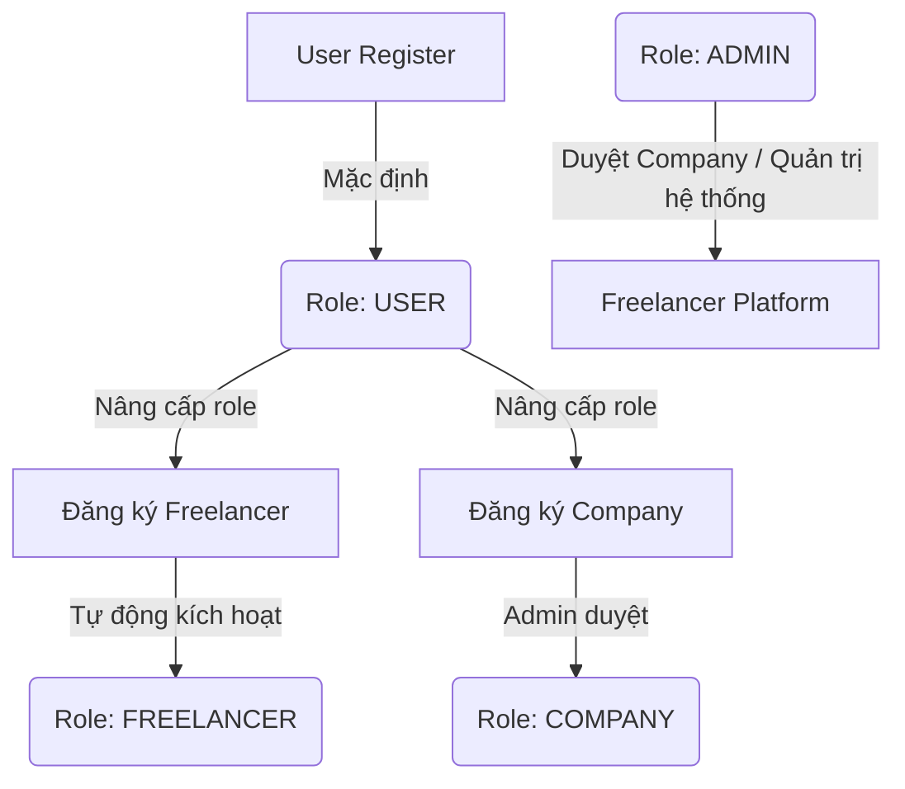

# 01 — PROJECT FOUNDATION

> [!IMPORTANT]
> **Tệp tin nền tảng gốc (Root Context File)**
> Đây là tài liệu quan trọng nhất. AI và Nhà phát triển (Developer) BẮT BUỘC phải đọc tài liệu này đầu tiên trước khi thực hiện bất kỳ tác vụ nào trong hệ thống frontend.

---

## 🎯 Tổng quan dự án

Hệ thống **Freelancer Collaboration Platform** là một nền tảng hỗ trợ kết nối doanh nghiệp và các chuyên gia tự do hàng đầu. Hệ thống được phân cấp phân quyền chặt chẽ thông qua 3 nhóm vai trò chính (Roles):

*   `ADMIN`: Quản trị viên điều hành toàn bộ nền tảng, phê duyệt thành viên và phân phối thanh toán.
*   `COMPANY`: Doanh nghiệp có nhu cầu đăng tuyển dự án, tạo lập đội ngũ và quản lý nhiệm vụ.
*   `FREELANCER`: Nhà phát triển tự do tìm kiếm cơ hội ứng tuyển dự án, nhận nhiệm vụ và rút thu nhập từ ví.

### 🌐 Mô hình Kiến trúc & Tích hợp
*   **Backend:** Spring Boot REST API + Spring Security, xác thực JWT (Access/Refresh Token JSON payload), cơ sở dữ liệu PostgreSQL. Tích hợp cổng VNPay cho giao dịch thanh toán và Firebase Realtime cho hệ thống thông báo tức thời.
*   **Frontend:** React + Vite + TypeScript (Strict Mode) + Ant Design 5.x & Tailwind CSS 3.x.

---

## 🛠 Tech Stack & Thư viện sử dụng

Để đảm bảo hiệu năng tối ưu, tính mở rộng và khả năng bảo trì lâu dài, dự án sử dụng các công nghệ tiêu chuẩn Enterprise:

| Lớp (Layer) | Công nghệ / Thư viện | Phiên bản / Mô tả |
| :--- | :--- | :--- |
| **Build Tool** | Vite | 5.x (Đảm bảo HMR nhanh siêu tốc) |
| **UI Framework** | React | 18.x (Functional Components + Hooks) |
| **Language** | TypeScript | 5.x (Bắt buộc chạy ở chế độ **Strict Mode**) |
| **UI Component Library** | Ant Design (AntD) | 5.x (Cung cấp Table, Modal, Form chuẩn hóa) |
| **Styling Engine** | Tailwind CSS | 3.x (Tối ưu hóa spacing, layout và responsive) |
| **State Management** | Zustand | 4.x (Quản lý luồng dữ liệu tối giản và hiệu quả) |
| **Routing System** | React Router | v6 (Quản lý nested routes & role-based guards) |
| **HTTP Client** | Axios | Tự động xử lý JWT Request & Refresh Token |
| **Form & Validation** | React Hook Form + Zod | Khai báo Schema-based validation chuẩn xác |
| **Data Visualization** | Recharts | Trực quan hóa dữ liệu biểu đồ phân tích |
| **Realtime Sync** | Firebase Web SDK | Đồng bộ trạng thái thông báo realtime |
| **Drag & Drop** | @dnd-kit/core | Tương tác kéo thả nhiệm vụ trên bảng Kanban |

---

## 👥 Phân quyền & Vai trò người dùng (User Roles)

> [!NOTE]
> Tất cả tài khoản mới đăng ký đều bắt đầu với role mặc định là `USER`. Từ role `USER`, người dùng có thể thực hiện đăng ký nâng cấp thành `FREELANCER` hoặc `COMPANY` (Company cần Admin phê duyệt).



### 1. ADMIN
*   Quản trị viên có toàn quyền kiểm soát hệ thống.
*   **Tính năng chính:** Phê duyệt/từ chối tài khoản Company đăng ký mới; Phê duyệt/từ chối dự án mới; Cấu hình hệ thống và luật chia phí dịch vụ (`payment-rules`); Gửi thông báo hệ thống đến Company/Freelancer; Theo dõi doanh thu thực tế và thống kê rút tiền của Freelancer.

### 2. COMPANY
*   Đơn vị tuyển dụng đăng tin và quản lý tiến độ thực tế dự án.
*   **Tính năng chính:** Tạo mới dự án; Khóa/Mở dự án ứng tuyển; Quản lý đội ngũ (`Team`), gán trưởng nhóm (`Leader`) cho dự án; Thực hiện nạp tiền & phân phối thanh toán dự án qua VNPay; Xem lịch sử giao dịch và dòng tiền.

### 3. FREELANCER
*   Các thành viên thực hiện dự án.
*   **Tính năng chính:** Tìm kiếm và ứng tuyển dự án phù hợp; Tham gia vào nhóm dự án; Nhận nhiệm vụ (`Task`) và cập nhật tiến độ; Quản lý ví cá nhân, thực hiện các yêu cầu rút tiền về tài khoản ngân hàng.

---

## ⚙️ Hệ thống Quyền Hạn Đặc biệt (Leader Permission)

Trong một dự án, Freelancer được giao vai trò quản lý nhóm sẽ có cờ cấu hình đặc biệt:

```typescript
isLeader: boolean; // Kế thừa từ thông tin thành viên trong Team
```

> [!TIP]
> Khi `isLeader === true`, Freelancer đó sẽ có các đặc quyền quản lý mà thành viên thường không có:
> *   Tạo lập các nhiệm vụ mới (`Task`) trong dự án.
> *   Phân bổ nhiệm vụ cho các thành viên trong nhóm.
> *   Cập nhật tiến độ tổng quan của dự án lên hệ thống.

---

## 📁 Cấu trúc Thư mục Dự án (Folder Structure)

Chúng tôi áp dụng cấu trúc thư mục dạng **Feature-driven** kết hợp **Clean Architecture** để tối ưu hóa việc phân tách trách nhiệm (Separation of Concerns):

```bash
src/
├── assets/             # Chứa hình ảnh, icons, font chữ tĩnh
├── components/         # Các thành phần tái sử dụng toàn cục
│   ├── common/         # Buttons, Input, Status Badge, Cards
│   └── layout/         # Header, Sidebar, Breadcrumb, Footer
├── constants/          # Định nghĩa cấu hình, URL API, các Enum tĩnh
├── features/           # Chứa các module nghiệp vụ biệt lập (Feature-driven)
│   ├── auth/           # Module Đăng nhập, Đăng ký, Đổi mật khẩu
│   ├── admin/          # Quản lý hệ thống dành cho Admin
│   ├── company/        # Màn hình chuyên biệt dành cho Company
│   ├── freelancer/     # Quản lý profile, kỹ năng Freelancer
│   ├── project/        # Nghiệp vụ xem danh sách, chi tiết, tạo dự án
│   ├── team/           # Quản lý nhóm thành viên trong dự án
│   ├── task/           # Kanban Board, giao việc, nộp báo cáo task
│   ├── payment/        # Cổng tích hợp VNPay, nạp tiền dự án
│   ├── wallet/         # Số dư ví, lịch sử giao dịch, rút tiền
│   ├── notification/   # Trung tâm thông báo Realtime
│   └── analytics/      # Biểu đồ báo cáo thống kê
├── hooks/              # Custom hooks dùng chung (useDebounce, useMediaQuery)
├── layouts/            # Các khung layout bao bọc (AdminLayout, PortalLayout)
├── lib/                # Cấu hình thư viện ngoài (axios.ts, firebase.ts)
├── pages/              # Các trang định tuyến tĩnh hoặc trang điều hướng chính
├── router/             # Cấu hình React Router + Route Guards
├── stores/             # Zustand global stores (authStore, walletStore...)
├── types/              # Khai báo TypeScript Interfaces dùng chung
└── utils/              # Các hàm bổ trợ (format tiền tệ, format ngày tháng)
```

### Quy chuẩn cấu trúc một Module nghiệp vụ (`features/*`)
Mỗi module bên trong thư mục `features/` tự đóng gói toàn bộ logic của nó để dễ dàng mở rộng hoặc tái cấu trúc mà không ảnh hưởng đến module khác:

```bash
features/project/
├── components/         # Component chỉ dùng riêng cho Module này
├── hooks/              # Custom hooks cục bộ phục vụ nghiệp vụ project
├── services/           # Định nghĩa các hàm call API trực tiếp thông qua Axios
├── store/              # Zustand store quản lý state nội bộ module (nếu cần)
├── types/              # Định nghĩa các kiểu dữ liệu nội bộ
└── index.ts            # Entry point export các thành phần ra ngoài
```

---

## 📐 Quy chuẩn Đặt tên (Naming Conventions)

Để thống nhất mã nguồn khi làm việc nhóm, tất cả các thành viên phải tuân thủ nghiêm ngặt quy tắc đặt tên sau:

| Đối tượng | Quy chuẩn đặt tên | Ví dụ |
| :--- | :--- | :--- |
| **Component** | `PascalCase.tsx` | `ProjectCard.tsx`, `DataTable.tsx` |
| **Custom Hook** | `camelCase` (bắt đầu bằng `use`) | `useDebounce.ts`, `useAuth.ts` |
| **Service Layer** | `camelCase` (kết thúc bằng `Service`) | `projectService.ts`, `authService.ts` |
| **Zustand Store** | `camelCase` (kết thúc bằng `Store`) | `walletStore.ts`, `authStore.ts` |
| **Types / Interface** | `kebab-case` + `.types.ts` | `project.types.ts`, `auth.types.ts` |
| **Page Component** | `PascalCase` + `Page.tsx` | `DashboardPage.tsx`, `ProjectDetailPage.tsx` |

---

## 🚫 Nguyên tắc Phát triển Toàn cục (Global Coding Rules)

> [!WARNING]
> Vi phạm các quy tắc này sẽ trực tiếp làm giảm chất lượng hệ thống và gây ra lỗi runtime. AI và lập trình viên cần thuộc lòng:

1.  **Tuyệt đối không sử dụng kiểu dữ liệu `any`:** Luôn khai báo Interface tường minh. Nếu chưa rõ kiểu dữ liệu, hãy dùng `unknown` rồi thực hiện Narrowing Type.
2.  **Không thực hiện cuộc gọi API trực tiếp bên trong UI Component:** Mọi hành động tương tác dữ liệu phải thông qua Service Layer (`services/`) và được quản lý trạng thái bằng Zustand Store.
3.  **Cách ly hoàn toàn Business Logic khỏi Giao diện:** UI Component chỉ đóng vai trò hiển thị và bắt sự kiện. Logic tính toán, xử lý dữ liệu phức tạp phải nằm trong Custom Hooks hoặc Stores.
4.  **Xử lý ngoại lệ (Error Handling) bắt buộc:** Mọi hàm bất đồng bộ (`async/await`) phải được bọc trong block `try/catch` hoặc bắt lỗi bằng `.catch()` để ngăn ngừa crash ứng dụng.
5.  **Cấm tuyệt đối Hardcode URL:** Tất cả các endpoint API phải sử dụng hằng số cấu hình hoặc lấy từ file môi trường `.env` thông qua biến `VITE_API_BASE_URL`.
6.  **Tối ưu hóa Import bằng Path Alias:** Sử dụng `@/` đại diện cho thư mục `src/` để đường dẫn luôn rõ ràng. Ví dụ: `import { useAuthStore } from '@/stores/authStore'`.
7.  **Không lưu trữ JWT Access Token trong localStorage:** Để bảo mật chống tấn công XSS, Access Token chỉ được lưu trữ trên bộ nhớ RAM của ứng dụng thông qua Zustand Store. Refresh Token sẽ được lưu trữ và đính kèm thủ công qua JSON Request Body theo đúng DTO của Spring Boot backend.

---

## 🌐 Cấu hình Môi trường (Environment Variables)

File `.env` mẫu dùng cho môi trường phát triển (Development):

```env
# URL gốc API của Spring Boot Backend (Port 8082 thực tế với context path /api/v1)
VITE_API_BASE_URL=http://localhost:8082/api/v1

# Tên và cấu hình ứng dụng
VITE_APP_NAME=FreelancerPlatform
VITE_APP_ENV=development

# Cấu hình Firebase Realtime Notification
VITE_FIREBASE_API_KEY=your_api_key
VITE_FIREBASE_AUTH_DOMAIN=your_project.firebaseapp.com
VITE_FIREBASE_PROJECT_ID=your_project_id
VITE_FIREBASE_STORAGE_BUCKET=your_project.appspot.com
VITE_FIREBASE_MESSAGING_SENDER_ID=your_sender_id
VITE_FIREBASE_APP_ID=your_app_id
```
