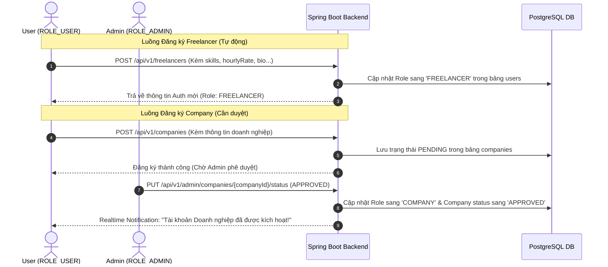

# 02 — AUTH & SECURITY FLOW

> [!IMPORTANT]
> **Quy trình Xác thực & Phân quyền Hệ thống**
> Tài liệu này mô tả chi tiết cơ chế bảo mật JWT, thiết kế Zustand Auth Store và logic đính kèm/refresh token tự động qua Axios Interceptor tương thích 100% với Spring Security backend.

---

## 🎯 Tổng quan về Hệ thống Phân quyền

Hệ thống phân quyền của Freelancer Collaboration Platform gồm 4 cấp độ vai trò (Roles) tăng dần:

```
[USER] ──(Đăng ký Profile)──> [FREELANCER]
   │
   └─────(Đăng ký Doanh nghiệp -> Chờ phê duyệt)──> [COMPANY] (ADMIN APPROVED)
                                                      ▲
[ADMIN] ────────────────(Phê duyệt & Điều hành)────────┘
```

*   **`USER`:** Người dùng thường vừa đăng ký tài khoản, chưa kích hoạt các tính năng chuyên sâu.
*   **`FREELANCER`:** Chuyên gia tự do có quyền ứng tuyển dự án, nhận nhiệm vụ và quản lý ví cá nhân.
*   **`COMPANY`:** Doanh nghiệp có ví tiền thanh toán, được quyền tạo dự án và phê duyệt thành viên.
*   **`ADMIN`:** Quản trị viên cấp cao có quyền phê duyệt Company, Project và điều phối dòng tiền hệ thống.

---

## 🧭 Luồng Nâng cấp Vai trò (Role Upgrade Workflow)

Tất cả người dùng khi đăng ký đều mang role mặc định là `USER`. Tùy thuộc vào mục đích sử dụng, người dùng có thể gửi yêu cầu nâng cấp vai trò theo luồng nghiệp vụ sau:



---

## 🔐 Chiến lược Quản lý JWT & Bảo mật

Để ngăn chặn tối đa các cuộc tấn công đánh cắp session (XSS, CSRF), dự án áp dụng chiến lược bảo mật kết hợp:

| Cơ chế | Mô tả chi tiết |
| :--- | :--- |
| **Access Token** | Sử dụng mã hóa **JWT (JSON Web Token)**, thời hạn tồn tại ngắn (30 phút). |
| **Refresh Token** | Thời hạn dài (7 ngày). Sử dụng để cấp mới Access Token khi hết hạn. |
| **Access Token Storage** | **Chỉ lưu trên bộ nhớ RAM (Zustand memory)** của ứng dụng React. Không lưu vào localStorage/sessionStorage. |
| **Refresh Token Storage**| Để tương thích 100% với Spring Boot backend, Refresh Token được lưu trữ trên **localStorage** ở Frontend và được truyền thủ công qua **JSON Request Body** (`TokenRefreshRequest`) trong các cuộc gọi `/auth/refresh` và `/auth/logout`. |
| **Auto Attach Token** | Sử dụng **Axios Interceptor** tự động điền header `Authorization: Bearer <accessToken>` trước mỗi request. |
| **Auto Refresh Token** | Khi Axios nhận về mã lỗi HTTP `401 Unauthorized`, hệ thống tự động gọi ngầm API `/auth/refresh` để xin cấp Access Token mới rồi tự động thử lại (Retry) request bị lỗi ban đầu mà người dùng không hề hay biết. |

---

## 🔑 Hợp đồng API Xác thực (Auth API Endpoints)

> [!WARNING]
> Mọi cuộc gọi API đều phải tuân thủ đúng port `8082` và tiền tố `/api/v1`.

### 1. Đăng ký Tài khoản mới
*   **API Path:** `POST /api/v1/auth/register`
*   **Request Body (`RegisterRequest`):**
    ```json
    {
      "email": "developer@gmail.com",
      "password": "SecurePassword123",
      "full_name": "Nguyễn Văn A"
    }
    ```
*   **Response Body (`ApiResponse<JwtResponse>`):**
    ```json
    {
      "success": true,
      "message": "OK",
      "data": {
        "access_token": "eyJhbGciOiJIUzI1NiIsIn...",
        "refresh_token": "63a8e9b4-0c58-47ad-9d2a-...",
        "user": {
          "id": "7b08da22-e427-466d-a7e8-466d67e2a9e5",
          "email": "developer@gmail.com",
          "full_name": "Nguyễn Văn A",
          "role": "USER",
          "avatar_url": null
        }
      }
    }
    ```

### 2. Đăng nhập Hệ thống
*   **API Path:** `POST /api/v1/auth/login`
*   **Request Body (`LoginRequest`):**
    ```json
    {
      "email": "developer@gmail.com",
      "password": "SecurePassword123"
    }
    ```
*   **Response Body (`ApiResponse<JwtResponse>`):**
    ```json
    {
      "success": true,
      "message": "OK",
      "data": {
        "access_token": "eyJhbGciOiJIUzI1NiIsIn...",
        "refresh_token": "63a8e9b4-0c58-47ad-9d2a-...",
        "user": {
          "id": "7b08da22-e427-466d-a7e8-466d67e2a9e5",
          "email": "developer@gmail.com",
          "full_name": "Nguyễn Văn A",
          "role": "FREELANCER",
          "avatar_url": "https://res.cloudinary.com/avatar.png"
        }
      }
    }
    ```

### 3. Làm mới Token (Refresh Token)
*   **API Path:** `POST /api/v1/auth/refresh`
*   **Request Body (`TokenRefreshRequest`):**
    > [!IMPORTANT]
    > Chú ý trường `refreshToken` gửi dạng **camelCase** theo đúng cấu trúc DTO đầu vào của Spring Boot.
    ```json
    {
      "refreshToken": "63a8e9b4-0c58-47ad-9d2a-..."
    }
    ```
*   **Response Body (`ApiResponse<TokenRefreshResponse>`):**
    ```json
    {
      "success": true,
      "message": "OK",
      "data": {
        "access_token": "eyJhbGciOiJIUzI1NiIsIn...",
        "refresh_token": "be8df9a1-8d23-4bbd-9a99-..."
      }
    }
    ```

### 4. Đăng xuất Hệ thống
*   **API Path:** `POST /api/v1/auth/logout`
*   **Request Body (`TokenRefreshRequest`):**
    ```json
    {
      "refreshToken": "be8df9a1-8d23-4bbd-9a99-..."
    }
    ```
*   **Response Body (`ApiResponse<Void>`):**
    ```json
    {
      "success": true,
      "message": "Logged out successfully"
    }
    ```

---

## 🗄 Thiết kế Zustand Auth Store

Zustand Store đóng vai trò lưu giữ Token và trạng thái phiên đăng nhập của người dùng trên RAM.

*   **File Path:** `@/stores/authStore.ts`

```typescript
import { create } from "zustand";

export type UserRole = "USER" | "FREELANCER" | "COMPANY" | "ADMIN";

export interface CurrentUser {
  id: string;
  email: string;
  full_name: string;
  role: UserRole;
  avatar_url: string | null;
}

interface AuthState {
  accessToken: string | null;
  user: CurrentUser | null;
  isAuthenticated: boolean;
  isInitializing: boolean;
  
  // Actions
  setAuth: (token: string, user: CurrentUser) => void;
  clearAuth: () => void;
  setInitializing: (value: boolean) => void;
  updateUserProfile: (profile: Partial<CurrentUser>) => void;
}

export const useAuthStore = create<AuthState>((set) => ({
  accessToken: null,
  user: null,
  isAuthenticated: false,
  isInitializing: true,

  setAuth: (token, user) =>
    set({
      accessToken: token,
      user,
      isAuthenticated: true,
    }),

  clearAuth: () =>
    set({
      accessToken: null,
      user: null,
      isAuthenticated: false,
    }),

  setInitializing: (value) =>
    set({
      isInitializing: value,
    }),
    
  updateUserProfile: (profile) =>
    set((state) => ({
      user: state.user ? { ...state.user, ...profile } : null
    })),
}));
```

---

## 🔧 Cấu hình Axios & Auto Refresh Token Interceptor

Đây là thành phần cốt lõi tự động hóa việc gán JWT Header và phục hồi phiên đăng nhập khi Access Token hết hạn.

*   **File Path:** `@/lib/axios.ts`

```typescript
import axios, { AxiosError } from "axios";
import { useAuthStore } from "@/stores/authStore";

const api = axios.create({
  baseURL: import.meta.env.VITE_API_BASE_URL,
  headers: {
    "Content-Type": "application/json",
  },
});

// 1. Request Interceptor: Tự động đính kèm Access Token vào header
api.interceptors.request.use(
  (config) => {
    const token = useAuthStore.getState().accessToken;
    if (token) {
      config.headers.Authorization = `Bearer ${token}`;
    }
    return config;
  },
  (error) => Promise.reject(error)
);

// 2. Xử lý hàng đợi (Queue) các request bị dừng khi đang đợi refresh token
let isRefreshing = false;
let failedQueue: Array<{
  resolve: (token: string) => void;
  reject: (error: unknown) => void;
}> = [];

const processQueue = (error: unknown, token: string | null = null) => {
  failedQueue.forEach((promise) => {
    if (token) {
      promise.resolve(token);
    } else {
      promise.reject(error);
    }
  });
  failedQueue = [];
};

// 3. Response Interceptor: Tự động bắt lỗi 401 và refresh token ngầm
api.interceptors.response.use(
  (response) => response,
  async (error: AxiosError) => {
    const originalRequest = error.config;
    if (!originalRequest) return Promise.reject(error);

    // Kiểm tra xem lỗi có phải do hết hạn JWT (401) và chưa thử lại (Retry)
    if (error.response?.status === 401 && !(originalRequest as any)._retry) {
      if (isRefreshing) {
        return new Promise<string>((resolve, reject) => {
          failedQueue.push({ resolve, reject });
        })
          .then((token) => {
            originalRequest.headers.Authorization = `Bearer ${token}`;
            return api(originalRequest);
          })
          .catch((err) => Promise.reject(err));
      }

      (originalRequest as any)._retry = true;
      isRefreshing = true;

      try {
        const storedRefreshToken = localStorage.getItem("refresh_token");
        if (!storedRefreshToken) {
          throw new Error("No refresh token stored");
        }

        // Gọi API refresh token của Spring Boot (truyền JSON Body)
        const response = await axios.post(
          `${import.meta.env.VITE_API_BASE_URL}/auth/refresh`,
          { refreshToken: storedRefreshToken }
        );

        const { access_token, refresh_token } = response.data.data;
        
        // Lưu trữ Refresh Token mới vào localStorage
        localStorage.setItem("refresh_token", refresh_token);

        // Lấy thông tin user hiện tại để cập nhật Store
        const currentUser = useAuthStore.getState().user;
        if (currentUser) {
          useAuthStore.getState().setAuth(access_token, currentUser);
        }

        processQueue(null, access_token);
        
        // Cấu hình lại request ban đầu với token mới và chạy lại
        originalRequest.headers.Authorization = `Bearer ${access_token}`;
        return api(originalRequest);
      } catch (refreshError) {
        processQueue(refreshError, null);
        
        // Dọn dẹp session và chuyển hướng về trang login
        useAuthStore.getState().clearAuth();
        localStorage.removeItem("refresh_token");
        window.location.href = "/login";
        
        return Promise.reject(refreshError);
      } finally {
        isRefreshing = false;
      }
    }

    return Promise.reject(error);
  }
);

export default api;
```

---

## 🔑 Auth Service Wrapper

*   **File Path:** `@/features/auth/services/authService.ts`

```typescript
import axios from "axios";
import api from "@/lib/axios";
import { useAuthStore } from "@/stores/authStore";

const BASE_URL = import.meta.env.VITE_API_BASE_URL;

export const authService = {
  register: async (fullName: string, email: string, password: string) => {
    const response = await axios.post(`${BASE_URL}/auth/register`, {
      full_name: fullName,
      email,
      password,
    });
    return response.data;
  },

  login: async (email: string, password: string) => {
    const response = await axios.post(`${BASE_URL}/auth/login`, {
      email,
      password,
    });
    
    const { access_token, refresh_token, user } = response.data.data;
    
    // Lưu Refresh Token vào localStorage
    localStorage.setItem("refresh_token", refresh_token);
    
    // Lưu Access Token & User Info vào Zustand RAM Store
    useAuthStore.getState().setAuth(access_token, user);
    
    return response.data.data;
  },

  logout: async () => {
    const storedRefreshToken = localStorage.getItem("refresh_token");
    try {
      if (storedRefreshToken) {
        await axios.post(`${BASE_URL}/auth/logout`, {
          refreshToken: storedRefreshToken,
        });
      }
    } finally {
      // Đảm bảo Frontend luôn dọn sạch Session dù cuộc gọi API có thành công hay không
      useAuthStore.getState().clearAuth();
      localStorage.removeItem("refresh_token");
    }
  },
};
```

---

## 🔄 Khôi phục Phiên đăng nhập (Session Restore)

Khi người dùng nhấn F5 tải lại trang, Access Token lưu trên RAM sẽ biến mất. Ứng dụng React cần tự động khôi phục phiên đăng nhập bằng cách gọi ngầm Refresh Token trong hàm khởi động `App.tsx`:

*   **File Path:** `@/App.tsx`

```tsx
import React, { useEffect } from "react";
import { useAuthStore } from "@/stores/authStore";
import axios from "axios";
import api from "@/lib/axios";

export const App: React.FC = () => {
  const { setAuth, clearAuth, setInitializing, isInitializing } = useAuthStore();

  useEffect(() => {
    const restoreSession = async () => {
      const storedRefreshToken = localStorage.getItem("refresh_token");
      if (!storedRefreshToken) {
        clearAuth();
        setInitializing(false);
        return;
      }

      try {
        // 1. Thực hiện lấy Access Token mới thông qua Refresh Token
        const response = await axios.post(
          `${import.meta.env.VITE_API_BASE_URL}/auth/refresh`,
          { refreshToken: storedRefreshToken }
        );
        const { access_token, refresh_token } = response.data.data;
        localStorage.setItem("refresh_token", refresh_token);

        // 2. Gọi API lấy thông tin Profile User hiện tại
        // Đính kèm Access Token mới lấy được vào request
        const meResponse = await api.get("/users/me", {
          headers: { Authorization: `Bearer ${access_token}` },
        });

        // 3. Khôi phục trạng thái xác thực trong Zustand Store
        setAuth(access_token, meResponse.data.data);
      } catch (error) {
        console.error("Failed to restore auth session:", error);
        localStorage.removeItem("refresh_token");
        clearAuth();
      } finally {
        setInitializing(false);
      }
    };

    restoreSession();
  }, [setAuth, clearAuth, setInitializing]);

  if (isInitializing) {
    return <div className="flex h-screen items-center justify-center">Loading Session...</div>;
  }

  return <YourRouterConfiguration />;
};
```
